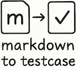

# Markdown to Testcase

A Python tool to extract test cases from Markdown files and convert them to CSV and Excel formats.



## Features

- Parse test cases from Markdown headings in the format `### TestCases (filename)`
- Support for direct YAML input files
- Generate CSV output files (one per test case section)
- Compile all test cases into a single Excel file with multiple sheets
- Detailed error reporting and suggestions for YAML parsing issues
- Automatic YAML validation with yamllint before processing
- Colorized console output using loguru

## Quick Start

```bash
# Install from PyPI
pip install markdown-to-testcase

# Convert a markdown file to test cases
markdown_to_testcase convert -i input_file.md

# Skip yamllint validation
markdown_to_testcase convert -i input_file.md --no-yaml-lint
```

## Example Input Format

### Markdown Format

```markdown
### TestCases (filename)
- ID: TC001
  Name: Test Case Name
  Desc: Test case description
  Pre-conditions: Required preconditions
  Test Steps: Steps to execute the test
  Expected Result: Expected outcome
  Actual Result: Actual outcome (recorded after testing)
  Test Data: Test data to use
  Priority: High/Medium/Low
  Severity: High/Medium/Low
  Status: Not executed/Passed/Failed
  Environment: Test environment information
  Tested By: Tester name
  Date: Test date
  Comments/Notes: Additional notes
```

### YAML Format

```yaml
filename1.md:
  - ID: TC001
    Name: Test Case Name
    # ... other fields
  - ID: TC002
    Name: Another Test Case
    # ... other fields
```

## Project Status

This project is actively maintained. Please see the [GitHub repository](https://github.com/tkykszk/markdown_to_testcase) for the latest updates and issues.
